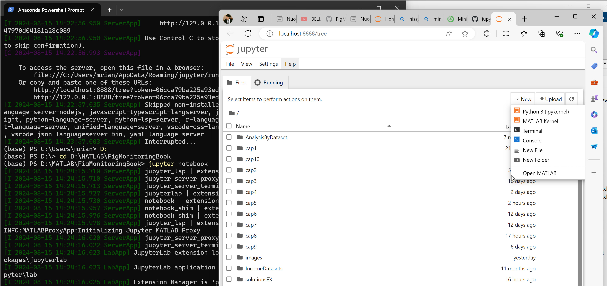
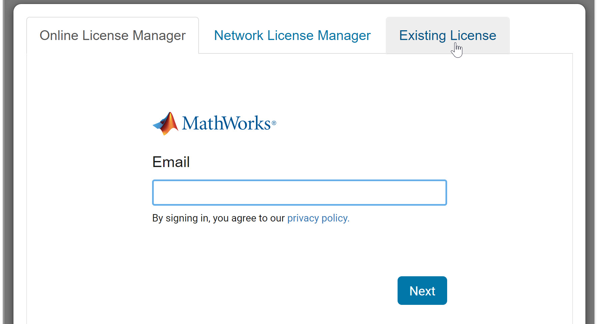

# Preface about Jupyter notebooks. What is this? Why do I need it?

 First of all let us address the question you have in your mind: “why I would want to run the .ipynb file inside a jupyter notebook?”.

Jupyter notebook is an editor that is [language agnostic](https://en.wikipedia.org/wiki/Language-agnostic) in the sense that under this environment it is possible to run any program: python code (through python kernel), MATLAB code (through MATLAB kernel), R code (through R kernel)  or any other language using the associated kernel.

Jupyter is written in Python and therefore needs python environment to run (however it could have been written in any other language), therefore you should have a python distribution (such as anaconda or miniconda). If for example miniconda is installed jupyter is launched through the miniconda power shell.


## WINDOWS INSTALLATION of jupyter notebooks

Here are the most relevant steps of the setup process.

If you already have a Python environment, open your Python terminal (not the CMD prompt!) (i.e. the Anaconda prompt) and paste the line below to install the jupiter notebook:

```
python -m pip install notebook
```

If you do not already have a Python setup you can copy/paste these lines in the Windows Terminal (CMD) in order to install a Python environment such as [miniconda](https://docs.anaconda.com/miniconda/#quick-command-line-install)

```
curl https://repo.anaconda.com/miniconda/Miniconda3-py311_24.5.0-0-Windows-x86_64.exe -o miniconda.exe
start /wait "" miniconda.exe /S
del miniconda.exe
```

Note that we recommend to install this specific version of Python  (3.11.24) because this 
is the last supported Python version to run the MATLAB kernel 


Now, still into the Python prompt (Anaconda prompt) if you type 

```
jupyter notebook
```

You should be able to start a new Jupyter notebook

If you get the error

`Jupyter is not recognized as an internal or external command`

as documented in the Stack Overflow Page

[Jupyter is not recognized](https://stackoverflow.com/questions/52287117/jupyter-is-not-recognized-as-an-internal-or-external-command)

try
```
pip install jupyter notebook 
python -m notebook 
```
Note at this point among the available kernels you just see the Python kernel.
You can open Jupyter notebooks containing MATLAB code without having MATLAB installed.

In order to run .ipynb files acording to the [official MathWorks documentation](https://github.com/mathworks/jupyter-matlab-proxy/blob/main/README.md) you need to 
1. install the MATLAB kernel 
2. have MATLAB installed in your computer
3. have a MATLAB license  

# Installation of MATLAB kernel inside Jupiter notebooks

In order to install the MATLAB kernel, in the python (anaconda) powershell you need to run the following command

```
python -m pip install jupyter-matlab-proxy
```

After typing `jupyter notebook` in the powershell if you have navigated into the folder FigMonitoringBook you should see inside localhost the subfolders of the book and in the background the terminal you used to launch the instruction jupiter notebook and from the button New you should be able to see the MATLAB kernel option





For example, after navigating to cap2 and opening the file areVarComparison and clicking on play button (Run this cell and advance) you should see


BE AWARE of the fact that MATLAB can take more than 90 seconds to start and ask you for a valid license before you can actually be able to use the notebook!


When you are prompted to enter your license, enter your credential and wait for MATLAB process to start.


### Troubleshooting after clicking on the play button


If you receive an error such as:

"Could not connect...." or
"MATLAB startup has timed out. Click Start MATLAB to try again",
or if you have installed a prerelease license, MATLAB tries to link your account to this license and says that you do not have a valid license.

In all these cases you have to:
1. terminate the process in the Python prompt with  CTRL+C (twice CTRL+C)
2. close the browser tab
3. delete the folder `<disk>:\Users\<user>\.matlab`
4. relaunch from the Python prompt: `jupyter notebook`
5. wait for the license check 
6. select `existing license` or or `Online License Manager` tab and confirm the choice 



Note that in order to force Jupiter MATLAB proxy not to use the prerelease version (or a particular release) it is necessary to rename MATLAB.exe file inside `R202xx\bin` folder of the prerelease or of the release you do not want to use (say to MATLABtmp.EXE). Of course the steps above remain.

Note that in the Python prompt it is possible to see which release Jupiter MATLAB proxy is trying to use

`INFO:MATLABProxyApp:Found MATLAB executable at: C:\Program Files\MATLAB\R2024a\bin\matlab.EXE`

Remark: of course do not forget to rename to MATLAB.exe the file MATLABtmp.EXE


#  Additional resources 

The official MathWorks reference on how to run  MATLAB code in Jupyter notebooks is at [Jupyter Proxy](https://github.com/mathworks/jupyter-matlab-proxy/blob/main/README.md)

See also the section [TroublesShooting](https://github.com/mathworks/jupyter-matlab-proxy/blob/main/troubleshooting/troubleshooting.md) 

